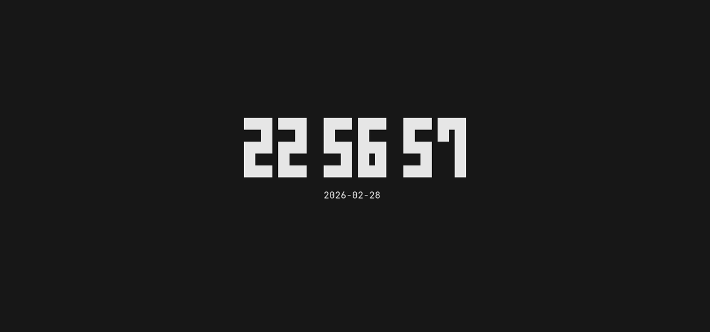

# Ametokei(雨時計)

_[**unofficial** fork from [Tenki(天気)](https://github.com/ckaznable/tenki)]_
_[**improved** from [Jikan(時間)](https://github.com/maachue/jikan/tree/master)]_

tty-clock with customizable configuration & weather effect written in Rust
and powered by [ratatui](https://github.com/ratatui-org/ratatui)  



## Credits

- [ckaznable](https://github.com/ckaznable) - async, weather background, struct.

## Roadmap

- [ ] Improve configuration  
- [x] Improve not enough size  
- [ ] Clean & modular code

## Installation

### Install from Cargo

```shell
cargo install --git https://github.com/maachue/ametokei.git
```

### Build from source

Ametokei is written in Rust, so you'll need to grab a Rust installation in order
to compile it.

```shell
git clone https://github.com/maachue/ametokei.git
cd ametokei
cargo build --release
./target/release/ametokei[.exe] -V
```

## Usage

### configuration

```toml
[general]
show_seconds = false
format_date = "%Y-%m-%d"
blink_colon = false
color = "White"
center = false
hour12h = false
utc = false
hide_date = false
font = "FONTNAME"
# default: `tenki` (default, from tenki), `digital` (from tty-clock)

[general.meridiem]
am = " [AM]"
pm = " [PM]"

[general.weather]
wind = "Disable"
mode = "Rain"

[performance]
tps = 60
fps = 60

[fontconfig]
spacing_horizontal = 1
spacing_vertical = 1

# Custom font
[font.FONTNAME]
colon_width = 4
num_width = 6
height = 5
symbols = ['█', '!', '!', '!', '!']
# improve the symbols later

colon = [
0,0,0,0,
0,1,1,0,
0,0,0,0,
0,1,1,0,
0,0,0,0
]

zero = [
1,1,1,1,1,1,
1,1,0,0,1,1,
1,1,0,0,1,1,
1,1,0,0,1,1,
1,1,1,1,1,1
]
one = [
0,0,0,0,1,1,
0,0,0,0,1,1,
0,0,0,0,1,1,
0,0,0,0,1,1,
0,0,0,0,1,1
]
two = [
1,1,1,1,1,1,
0,0,0,0,1,1,
1,1,1,1,1,1,
1,1,0,0,0,0,
1,1,1,1,1,1
]
three = [
1,1,1,1,1,1,
0,0,0,0,1,1,
1,1,1,1,1,1,
0,0,0,0,1,1,
1,1,1,1,1,1
]
four = [
1,1,0,0,1,1,
1,1,0,0,1,1,
1,1,1,1,1,1,
0,0,0,0,1,1,
0,0,0,0,1,1
]
five = [
1,1,1,1,1,1,
0,0,0,0,1,1,
1,1,1,1,1,1,
1,1,0,0,0,0,
1,1,1,1,1,1
]
six = [
1,1,1,1,1,1,
1,1,0,0,0,0,
1,1,1,1,1,1,
1,1,0,0,1,1,
1,1,1,1,1,1
]
seven = [
1,1,1,1,1,1,
0,0,0,0,1,1,
0,0,0,0,1,1,
0,0,0,0,1,1,
0,0,0,0,1,1
]
eight = [
1,1,1,1,1,1,
1,1,0,0,1,1,
1,1,1,1,1,1,
1,1,0,0,1,1,
1,1,1,1,1,1
]
nine = [
1,1,1,1,1,1,
1,1,0,0,1,1,
1,1,1,1,1,1,
0,0,0,0,1,1,
1,1,1,1,1,1
]
```

Wants to see an example? [Here](./config/demo.toml)

### CLI

```
Usage: ametokei [OPTIONS]

Options:
  -f, --fps <FPS>
          frame per seconds [default: 60]
  -t, --tps <TPS>
          tick per seconds [default: 60]
      --hour12 <HOUR12>
          set the hour in 12h format [possible values: true, false]
  -c, --center <CENTER>
          center of the terminal [possible values: true, false]
      --utc <UTC>
          use UTC time [possible values: true, false]
      --show-seconds <SHOW_SECONDS>
          show seconds [possible values: true, false]
      --blink-colon <BLINK_COLON>
          blink colon of timer [possible values: true, false]
      --format-date <FORMAT_DATE>
          set the date format [default: "%Y-%m-%d"]
      --hide-date
          hide date
      --timer-color <TIMER_COLOR>
          color of the clock
      --timer-mode <TIMER_MODE>
          [possible values: dvd]
      --font <FONT>
          font name
      --wind <WIND>
          wind mode [possible values: random, disable, only-right, only-left]
      --level <LEVEL>
          effect level, The lower, the stronger
      --bg-mode <BG_MODE>
          [possible values: rain, snow, meteor, disable]
      --config <CONFIG>
          custom config path
      --no-config
          no-config mode
      --generate-config [<GENERATE_CONFIG>]
          create config
  -h, --help
          Print help
  -V, --version
          Print version
```

## LICENSE

[MIT](./LICENSE)
